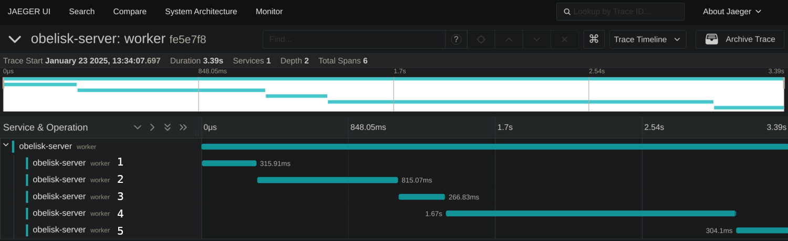
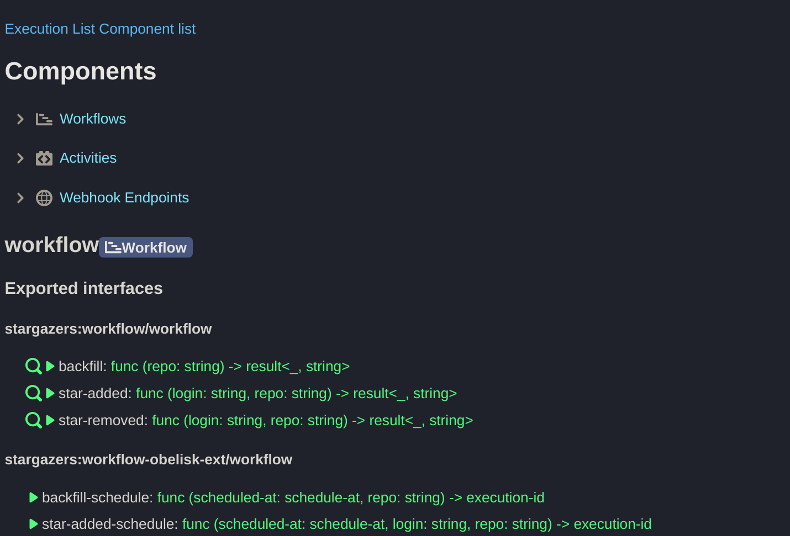

# Stargazers

A simple [Obelisk](https://github.com/obeli-sk/obelisk) webhook endpoint and a workflow
that monitors GitHub repositories. Every step is persisted and replayed during crash recovery.

## Workflow Code Example - `star-added`

```rust
fn star_added(login: String, repo: String) -> Result<(), String> {
    // 1. Persist the user giving a star to the project.
    let description = db::user::link_get_description(&login, &repo)?;
    if description.is_none() {
        // 2. Fetch the account info from GitHub.
        let info = account::account_info(&login)?;
        // 3. Fetch the prompt from Turso database.
        let settings_json = db::llm::get_settings_json()?;
        // 4. Generate the user's description.
        let description = llm::respond(&info, &settings_json)?;
        // 5. Persist the generated description.
        db::user::user_update(&login, &description)?;
    }
    Ok(())
}
```

Here is the complete [workflow source](./workflow/src/lib.rs) and the
[WIT file](./workflow/interface/workflow.wit) describing the interface .
The parallel version of the `star-added` function is in branch `parallel`.

The following screenshot shows how the `star-added` workflow calls the activities
with their respective numbers.



Executions can be submitted, inspected etc. using the Web UI.




## Setting up

### Setting up the external services
The activities require tokens to be present.

#### Turso activity
Follow the prerequisites section of the [activity-db-turso README](./activity/db/turso/README.md).

#### ChatGPT activity
Follow the prerequisites section of the [activity-llm-chatgpt README](./activity/llm/chatgpt/README.md).

#### GitHub activity
Follow the prerequisites section of the [activity-account-github README](./activity/account/github/README.md).

#### GitHub webhook endpoint
Follow the prerequisites section of the [webhook README](./webhook//README.md).

### Running

Set up the environment:
If [direnv](https://github.com/direnv/direnv) and [Nix](https://nixos.org/) are available:
```sh
cp .envrc-example .envrc
direnv allow
```
Otherwise install the following:
* [Obelisk](https://github.com/obeli-sk/obelisk)
* Optionally [Rust](https://rustup.rs/) for building the WASM components locally, version and other components are specified in [rust-toolchain.toml](./rust-toolchain.toml)
* Optinally [Wasmtime](https://wasmtime.dev/) for integration testing of activities
* Optinally [Cloudflared](https://github.com/cloudflare/cloudflared) for exposing the webhook endpoint

The exact versions of dependencies used for development and testing are in [dev-deps.txt](./dev-deps.txt).

```sh
obelisk server run --config ./obelisk-oci.toml
```

The server will start downloading the WASM components from the Docker Hub. Wait for the following
lines in the process output:

```log
HTTP server `webhook_server` is listening on http://127.0.0.1:9090
HTTP server `webui` is listening on http://127.0.0.1:8080
Serving gRPC requests at 127.0.0.1:5005
```

The workflow can be started using the Web UI.
The webhook endpoint can be triggered using `curl` or by seting up the webhook
in a GitHub repo. See the [webhook documentation](webhook/README.md) for details
on how to set up GitHub and a https tunnel to the local instance.

### Building the WASM components locally
The configuration above downloads the WASM Components from the Docker Hub.
To build all the components locally run
```sh
cargo build
obelisk server run --config ./obelisk-local.toml
```
